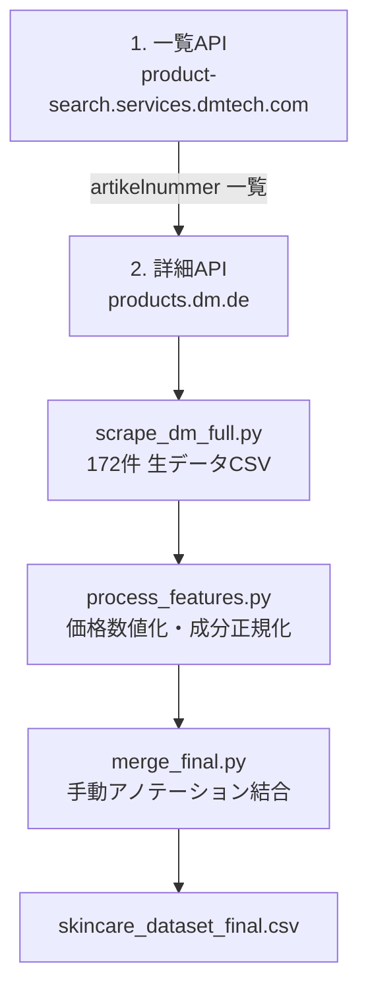

# dm.de 製品データ収集パイプライン

Serum & Kurカテゴリの分析のために構築した、dm.deの製品データ(価格・rating・成分)を
自動取得するパイプラインの仕様書。**他の製品カテゴリに展開する際は、このドキュメントに
沿って「変更が必要な箇所」だけを差し替えれば再利用できる**ように設計している。

試行錯誤の詳しい経緯は [`data_collection_process.md`](./data_collection_process.md) を参照。
このドキュメントは「結果として何が確立したか」のリファレンスに専念する。

## 全体構成



| ステップ | スクリプト | 役割 |
|---|---|---|
| 1〜3 | `scrape_dm_full.py` | 一覧API→詳細APIの順に叩き、生データCSVを作る |
| 4 | `process_features.py` | 価格の数値化、成分の正規化・配合順位付け |
| 5 | `merge_final.py` | 手動でつけたconcern等のアノテーションを結合(該当分のみ) |

## API仕様

### 1. 一覧API(カテゴリ内の製品ID・価格・rating取得)

```
GET https://product-search.services.dmtech.com/de/search/static
    ?allCategories.id={カテゴリID}
    &pageSize=30
    &currentPage={0始まりのページ番号}
    &searchType=editorial-search
    &sort=editorial_relevance
    &type=search-static
    &enablePharmacy=true
```

- レスポンスの `totalPages` を見て、`currentPage` を 0 から `totalPages-1` までループする
- レスポンスの `count` が対象カテゴリの総製品数
- **2ページ目以降で `429 Too Many Requests` が発生しやすい**(リクエスト先が内部的に `/search/crawl` という別経路に切り替わる)。8秒以上の間隔と、429時の自動リトライを必ず入れること(`request_with_retry()` 参照)

### 2. 詳細API(製品ごとの成分・肌タイプ取得)

```
GET https://products.dm.de/product/products/detail/DE/dan/{artikelnummer}
```

- `descriptionGroups` という配列の中から、`header` が `"Inhaltsstoffe"` のブロックを探して成分テキストを取得する
- 同様に `header` が `"Produktmerkmale"` のブロックから `Hauttyp` 等の属性を取得できる
- カテゴリによっては `descriptionGroups` の中身の見出し名が異なる可能性がある(例: ヘアケアなら "Haartyp" など)。**新カテゴリに展開する際は、1商品分のレスポンスを必ず目視確認すること**

## 新しいカテゴリに展開する際の手順

1. dm.deで対象カテゴリのページを開き、DevToolsで一覧APIのURLから `allCategories.id` の値を控える
2. `scrape_dm_full.py` の `LIST_PARAMS_BASE["allCategories.id"]` を書き換える
3. 出力先の `OUTPUT_PATH` をカテゴリ名がわかるファイル名に変更する(例: `skincare_dataset_shampoo_raw.csv`)
4. 実行し、1商品分のレスポンスで `descriptionGroups` の見出し名が Serum & Kur と同じか確認する。違う場合は `find_group()` に渡す見出し名を調整する
5. `process_features.py` の `KEY_INGREDIENT_KEYWORDS` を、そのカテゴリで注目したい成分に差し替える(例: ヘアケアならシリコン系、UVケアならUVフィルター系など)
6. 成分の区切り文字の表記ゆれ(`•`, `·`, 改行など)は、カテゴリが変わっても同様に起こりうるので、`ingredient_count` が極端に少ない行がないか毎回チェックする

## 既知のデータ品質の問題と対処

| 問題 | 症状 | 対処 |
|---|---|---|
| 成分の区切り文字がブランドによって不統一 | `,` 以外に `•`(bullet)、`·`(middle dot)を使うブランドがある | `parse_ingredients()` で事前に正規化してから分割 |
| 1つの成分欄に複数バリエーション商品が混在 | 改行区切りで複数の見出し(例: "〇〇-Kur:")が並ぶ | `ingredients_multi_variant_flag` で検知し、分析時は除外か注記で対応 |
| 価格がドイツ語表記 | `"4,95 €"` のような文字列 | `clean_price()` でカンマ→ピリオド変換後にfloat化 |
| 一覧APIのレート制限 | 2ページ目以降で429 | 8秒以上の間隔+自動リトライ(`request_with_retry()`) |

## 最終データのスキーマ(主要列)

| 列名 | 内容 | 取得元 |
|---|---|---|
| `artikelnummer` | 商品番号(dan) | 一覧API |
| `brand`, `name` | ブランド名・商品名 | 一覧API |
| `price_eur_clean` | 価格(数値、ユーロ) | 一覧API→加工 |
| `rating_value`, `rating_count` | 評価・レビュー数 | 一覧API |
| `categories` | dm.de側のカテゴリタグ | 一覧API |
| `hauttyp` | 肌タイプ表記 | 詳細API |
| `ingredients_raw` / `ingredients_list_str` | 成分(生テキスト/正規化後リスト) | 詳細API→加工 |
| `ingredient_count` | 総成分数 | 加工 |
| `{成分名}_present` / `_rank` / `_rank_norm` | 注目成分ごとの配合有無・順位・正規化順位 | 加工 |
| `has_manual_annotation` 以降 | 手動アノテーション(concern等、該当分のみ) | 手動データ結合 |

## 倫理的配慮のチェックリスト(新カテゴリでも毎回確認)

- [ ] 対象ドメインのrobots.txtで、使用するエンドポイントが禁止されていないか確認した
- [ ] リクエスト間隔を十分に空けている(一覧API: 8秒以上、詳細API: 2秒以上)
- [ ] 429等のレート制限応答に対して、待機時間を延ばしながら再試行する実装になっている
- [ ] 取得するのは公開されている製品ページの情報の範囲内である
