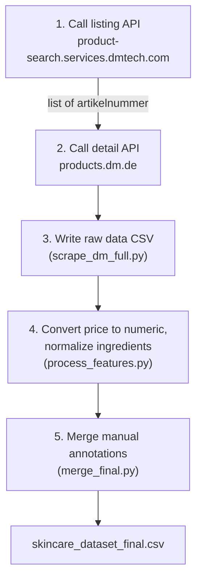

# dm.de Product Data Collection Pipeline (Specification)

Specification for the pipeline that automatically collects dm.de product data
(price, rating, ingredients), originally built for the Serum & Kur category.
**Designed so that adapting it to a new product category only requires
swapping out the parts flagged as "needs to change" in this document.**

For the detailed story of how this was built through trial and error, see
[`data_collection_process.md`](./data_collection_process.md). This document
focuses purely on "what was ultimately established" as a reference.

## Overview



| Step | Script | Role |
|---|---|---|
| 1-3 | `scrape_dm_full.py` | Calls the listing API then the detail API to build the raw data CSV |
| 4 | `process_features.py` | Converts price to numeric, normalizes ingredients and ranks them |
| 5 | `merge_final.py` | Merges manually annotated data such as skin-concern tags (for the subset that has it) |

## API Specification

### 1. Listing API (product IDs, price, and rating within a category)

```
GET https://product-search.services.dmtech.com/de/search/static
    ?allCategories.id={category ID}
    &pageSize=30
    &currentPage={page number, starting at 0}
    &searchType=editorial-search
    &sort=editorial_relevance
    &type=search-static
    &enablePharmacy=true
```

- Check `totalPages` in the response and loop `currentPage` from 0 to `totalPages - 1`
- `count` in the response is the total number of products in the target category
- **`429 Too Many Requests` tends to occur from page 2 onward** (the request internally gets
  routed to a different path, `/search/crawl`). Always use an interval of at least 8 seconds
  and implement automatic retry on 429 (see `request_with_retry()`)

### 2. Detail API (per-product ingredients and skin type)

```
GET https://products.dm.de/product/products/detail/DE/dan/{artikelnummer}
```

- Find the block in the `descriptionGroups` array whose `header` is `"Inhaltsstoffe"` to get
  the ingredients text
- Similarly, the block whose `header` is `"Produktmerkmale"` contains attributes such as
  `Hauttyp` (skin type)
- The heading names inside `descriptionGroups` may differ by category (e.g. "Haartyp" for
  hair care). **When adapting this to a new category, always manually inspect the response
  for at least one product**

## Steps for Adapting to a New Category

1. Open the target category's page on dm.de and note the `allCategories.id` value from the
   listing API URL in DevTools
2. Update `LIST_PARAMS_BASE["allCategories.id"]` in `scrape_dm_full.py`
3. Change `OUTPUT_PATH` to a filename that identifies the category (e.g.
   `skincare_dataset_shampoo_raw.csv`)
4. Run it, and check whether the heading names in `descriptionGroups` match those used for
   Serum & Kur for a single product's response. If they differ, adjust the heading names
   passed to `find_group()`
5. Replace `KEY_INGREDIENT_KEYWORDS` in `process_features.py` with the ingredients relevant
   to that category (e.g. silicones for hair care, UV filters for sun care)
6. Ingredient-list delimiter inconsistencies (`•`, `·`, line breaks, etc.) can occur in any
   category, so always check for rows with an unexpectedly low `ingredient_count`

## Known Data Quality Issues and How They're Handled

| Issue | Symptom | Handling |
|---|---|---|
| Ingredient list delimiters are inconsistent across brands | Some brands use `•` (bullet) or `·` (middle dot) instead of `,` | Normalize these to commas before splitting, in `parse_ingredients()` |
| A single ingredients field contains multiple product variants | Multiple headings (e.g. "XX-Kur:") separated by line breaks | Detected via `ingredients_multi_variant_flag`; exclude or annotate during analysis |
| Price is in German notation | A string like `"4,95 €"` | `clean_price()` converts comma to period, then casts to float |
| Listing API rate limiting | 429 from page 2 onward | Interval of 8+ seconds plus automatic retry (`request_with_retry()`) |

## Final Data Schema (Key Columns)

| Column | Content | Source |
|---|---|---|
| `artikelnummer` | Product number (dan) | Listing API |
| `brand`, `name` | Brand name and product name | Listing API |
| `price_eur_clean` | Price (numeric, euros) | Listing API → processed |
| `rating_value`, `rating_count` | Rating and review count | Listing API |
| `categories` | dm.de's own category tags | Listing API |
| `hauttyp` | Skin type label | Detail API |
| `ingredients_raw` / `ingredients_list_str` | Ingredients (raw text / normalized list) | Detail API → processed |
| `ingredient_count` | Total number of ingredients | Processed |
| `{ingredient}_present` / `_rank` / `_rank_norm` | Presence, rank, and normalized rank for each ingredient of interest | Processed |
| `has_manual_annotation` and following columns | Manual annotations (e.g. concern), only for the annotated subset | Merged from manual data |

## Ethical Considerations Checklist (recheck for every new category)

- [ ] Confirmed the target domain's robots.txt does not disallow the endpoints being used
- [ ] Sufficient delay between requests (8+ seconds for the listing API, 2+ seconds for the detail API)
- [ ] Rate-limit responses (429, etc.) are handled by retrying with an increasing wait time
- [ ] Only information already shown on public product pages is being collected
